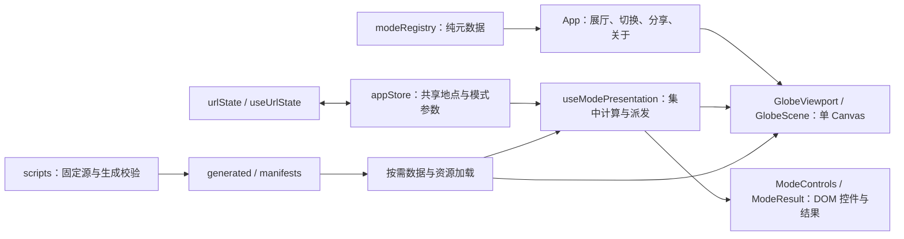

# Mundus：产品与架构契约

- 状态：当前静态地球展品的产品与架构契约
- 当前工作约定：仓库根目录 [AGENTS.md](../AGENTS.md)
- 更新日期：2026-10-09
- 实现与发布历史：[IMPLEMENTATION.md](IMPLEMENTATION.md)

## 1. 项目定位

Mundus 是一个“数字博物馆展品 × 科学仪器 × 互动图鉴”式的三维地球实验室。

> 每个模式都是一副重新观察地球的镜片，而不是传统地图中的一个图层。

项目面向普通探索者、科学传播和前端图形爱好者。不服务导航、街道级查询、专业 GIS 编辑或测绘。

- 少量有完整解释的观察模式，每个模式围绕一个清晰问题。
- 羊皮纸展览视觉、克制的色彩、编辑式排版与艺术化地球，不使用卫星底图或赛博 HUD。
- 中英双语界面和文档。
- 首屏是可交互地球与中立展厅，不设置独立营销落地页。
- 桌面与移动端完成同一探索循环。

核心体验循环：选择一种观察方式，操纵地球，获得一个清晰发现，查看解释与来源，分享当前状态，再进入下一个模式并保留所选地点。

## 2. 当前产品范围

当前有四个观察模式。地球另一端、姓氏观察、城市邻近性是 `primary` 主模式；日照线是 `more` 模式，收在“更多观察”。裸地址进入中立展厅，由用户选择观察方式。

### 2.1 地球另一端 / Other Side（`antipodes`）

- 通过点击、坐标输入、本地城市搜索或主动授权定位选择地点。
- 同时标记起点与对跖点，用穿过地心的连线和镜头翻转表现空间关系。
- 展示双方坐标、国家或海洋、地心直线距离和半球表面距离，并分别显示 GeoNames 固定快照中距两端最近的符合条件主要城市；它们不是最近聚居地、行政边界或建成区结果。
- 提供精选示例，帮助用户理解模式。
- 分享前提示链接会编码并恢复所选位置；当前界面生成规范精度链接，既有合法整度坐标链接继续可读取。

### 2.2 姓氏观察 / Surname Atlas（`surnames`）

- 在有来源记录的国家显示姓氏字标，可切换当地文字、拉丁转写与中文形式。
- 来源有数字排名时显示最高频记录；无排名的来源列出或人工整理记录保留各自标签。
- 社区来源的覆盖、采样和年份并不统一，不把它们描述成全球可比较的官方人口普查排名。
- 结果保留逐国来源与缺失状态；人工整理而未逐条核实的记录明确标注。
- 名字形式由 Mundus 审阅，不在运行时猜测中文音译。

数据与命名契约见 [NAMING_OBSERVATION_RESEARCH.md](NAMING_OBSERVATION_RESEARCH.md)。

### 2.3 城市邻近性 / Urban Proximity（`isolation`）

- 以 GHSL 2025 年人口至少 100 万的城市中心为可选中心，竞争城市全集的门槛是至少 10 万人。
- 用 α 控制“达标城市”的人口门槛：竞争城市人口至少为所选城市的 α 倍。α 范围为 0.10–1.00，步长 0.01，默认 0.50。
- 单城视图显示到最近达标城市中心的大圆距离、竞争城市、排名、前 10 名和阶梯图；没有竞争城市时保留明确的缺失状态。
- 全球分区视图将陆地点归属“大圆距离 ÷ 当前层级邻近距离”最小的中心。边界可以弯曲、不规则，并随 α 的人口门槛发生阶梯变化。
- 没有定义正距离的中心仍可见、可选，但不参与分区。分区表示几何上的相对邻近关系，不代表交通、经济势力或行政范围。
- 城市和国家名来自经审阅的固定构建输入与覆盖表；资产中的缺失中文名保持 `null`，不从空间邻近候选自动补入资产，界面按命名契约显示英文 fallback。

产品、指标、分区与名字契约见 [URBAN_ISOLATION.md](URBAN_ISOLATION.md)。内部模式 id `isolation` 保留旧链接兼容。

### 2.4 日照线 / Sunline（`sunline`）

- 展示实时或 2000–2099 年固定日期的昼夜分界、晨昏带和太阳直射点。
- 支持时间播放、日期与时间调整、回到此刻，以及赤道、回归线和极圈辅助线。
- 点选位置后展示太阳高度、昼夜状态和近似日出日落。
- 计算仅用于教育与互动展示，不是法律、航海、航空或工程时间服务。

### 2.5 已下线观察与范围边界

“发展的不同侧面 / Development, Unpacked”于 2026-10 下线。代码、UNDP 数据与署名已移除；任何版本的 `mode=development` 旧链接回到展厅并显示可关闭的下线提示。

当前范围不包括后端、账号、云端用户数据、远程插件市场、在线地理编码、街道级搜索、专业 GIS 工具、PWA、离线包和实时自然事件。新增观察需先完成产品、数据许可、资源预算与无障碍评审。

## 3. 体验与视觉设计

### 3.1 信息架构

桌面以地球为主画面：顶部是品牌、三个主模式入口、“更多观察”、分享、关于和语言；进入模式后左上显示问题，右侧显示结果，控件按模式放在独立面板中。展厅使用同一模式目录提供入口，不加载模式专属数据。

移动端在顶部保留模式切换，地球位于中间，结果与可折叠控件排列在下方。旋转、缩放、点选与面板滚动分别处理，所有主要触控目标至少为 44px。

方法、数据来源、许可和软件声明集中在“关于”对话框；地球上的简短署名可打开它。结果保留与该结果有关的限制说明，例如人工整理姓氏的未核实状态。

### 3.2 交互原则

- 首次显示可关闭的拖拽与缩放提示；有意义的探索后结束引导。
- 模式切换与返回展厅保留地点和同一 Canvas 的相机上下文；进入模式和返回展厅同步管理焦点。
- 初始地球可缓慢自转，用户开始交互后停止；全球分区保持静态，仍可手动旋转。
- 单个模式加载或渲染失败时提供局部重试与返回展厅，保留壳层入口。
- 模式、地点、姓氏文字形式、城市 α/视图和固定太阳时间进入可分享 URL。
- `prefers-reduced-motion` 下减少自动旋转、飞行动画和界面转场。

### 3.3 无障碍与降级

- 控件、结果、排名和数据说明使用语义化 DOM，不只存在于 Canvas。
- 支持键盘旋转、缩放、点选、模式切换、列表选择和对话框焦点管理。
- 颜色配合数值、文字和标记，不承担唯一的数据含义。
- 选择结果通过克制的 live region 宣读。
- WebGL2 初始化失败时显示静态地球预览、说明和仍可操作的坐标/数据界面。
- [WCAG 2.2 AA](https://www.w3.org/TR/WCAG22/) 是验收目标；自动测试不替代人工无障碍验收。

## 4. 技术与渲染

- Vite、React 19、TypeScript strict；Node 与 pnpm 版本由 `package.json` 和锁文件固定。
- Three.js `WebGLRenderer`、React Three Fiber 9 与 Drei，共用一个 WebGL Canvas。
- Zustand 管理跨模式状态、相机焦点意图和共享资源状态；Zod 校验参数和数据清单。
- `d3-geo`、`topojson-client` 和 Natural Earth 处理球面地理与国家拾取；`meshoptimizer` 压缩矢量资产。
- CSS Modules 与全局设计令牌提供样式，不引入通用 UI 组件库、后端或运行时插件层。
- Vitest、Testing Library、Node 测试和 Playwright 覆盖纯计算、组件、构建脚本与浏览器交互。

`GlobeViewport` 拥有 Canvas 和能力降级，`GlobeScene` 组合地球、相机与模式图层。国家表面使用合并矢量几何和小型调色板纹理，原栅格球面保留为加载/失败回退。低画质加载 110m，中/高画质加载 50m；画质和 DPR 根据设备信号自动选择。

国家拾取使用本地 Natural Earth 边界。模式图层使用声明式 R3F 组件，不创建第二个 renderer，不将 Three.js Mesh 结构暴露给模式控件。Canvas 采用 `frameloop="demand"`，有意动画通过逐帧更新和失效请求驱动；模式退出时清理模式专属的播放、监听器、worker 与 GPU 资源。

最终产物是纯静态 `dist/`。Vite 使用相对路径 `base: './'` 和 ES2022 目标，生产包不含 source map；GitHub Pages 部署流程见 [RELEASE_RUNBOOK.md](RELEASE_RUNBOOK.md)。

## 5. 系统架构


```mermaid
flowchart LR
    URL["urlState / useUrlState"] <--> State["appStore：共享地点与模式参数"]
    Metadata["modeRegistry：纯元数据"] --> Shell["App：展厅、切换、分享、关于"]
    State --> Presentation["useModePresentation：集中计算与派发"]
    Shell --> Globe["GlobeViewport / GlobeScene：单 Canvas"]
    Presentation --> Globe
    Presentation --> UI["ModeControls / ModeResult：DOM 控件与结果"]
    Build["scripts：固定源与生成校验"] --> Assets["generated / manifests"]
    Assets --> Loaders["按需数据与资源加载"]
    Loaders --> Presentation
    Loaders --> Globe
```

### 5.1 应用壳层与共享状态

`src/app/App.tsx` 组合顶部导航、中立展厅、懒加载地球、模式体验、分享和关于对话框。地球与模式体验各有恢复边界，失败范围保持局部。`appStore` 保存活动模式、共享地点、各模式参数和相机焦点意图；国家选择由共享地点派生。

### 5.2 模式目录与集中派发

`src/features/modes/modeRegistry.ts` 只保存模式顺序、`primary/more` 分组、双语标题/问题/摘要、状态 Schema、相机策略和资源 id。它不包含 hooks、加载器、renderer 对象、可变状态或通用生命周期框架。

`useModePresentation` 与 `useGlobePresentation` 根据活动模式计算结果和地球呈现；`ModeControls`、`ModeResult` 使用穷尽分支派发到各模式的控件和结果。城市卡片与地球共用选择计算。模式专属控件、数据和较重资源按需加载，非活动模式跳过计算和请求；返回展厅不加载任何模式专属数据。

城市分区共享一个按需 worker 生成候选索引；α 改变或退出时取消旧计算。shader 使用候选索引计算加权大圆距离，索引不是分区边界的栅格近似。

### 5.3 URL 状态

`src/state/urlState.ts` 集中解析与序列化查询参数，`src/app/useUrlState.ts` 同步浏览器历史和后退/前进。当前链接显式使用 `v=2`：

```text
/?v=2&mode=isolation&point=1.35,103.84&alpha=0.75&view=field
```

| URL 形态                      | 行为                                            |
| ----------------------------- | ----------------------------------------------- |
| 裸地址                        | 中立展厅                                        |
| 无版本且带历史状态，或 `v=1`  | 保留旧解析语义；模式缺失或无效时回退 Other Side |
| `v=2` 不含 `mode`             | 展厅；合法 `point` 恢复共享地点                 |
| `v=2&mode=<有效 id>`          | 指定观察模式                                    |
| `v=2` 含未知模式              | 展厅与可关闭的未知模式提示                      |
| 任意版本的 `mode=development` | 展厅与可关闭的下线提示                          |

- 经纬度序列化最多四位小数；非法坐标回退默认地点，默认值省略。
- 日照线固定时间以 UTC 分钟精度写入 `time`；无有效固定时间时使用实时状态。
- 姓氏形式写入 `surname`；城市模式使用 `alpha` 和 `view=field`。
- 网址中非法或越界 α 回退 0.50，不截断到上下限；滑块与 store 设置函数使用截断规则。
- 模式、地点或视图等离散变化创建历史项；仅太阳时间或 α 连续变化替换当前历史项。相机姿态不进入当前共享 URL。
- 打开对话框不改 URL。语言由浏览器偏好初始化，首次提示关闭状态保存在本地；它们不进入共享链接。

### 5.4 数据注册与生成资产

`src/data/registry.ts` 校验并汇总 `src/data/manifests/` 的来源、许可、版本、获取时间、校验和、转换、署名、再分发和缺失/边界政策，供“关于”说明使用。经审阅的快照和矢量资产位于 `src/data/generated/`。

国家连接使用内部 `countryId` 和显式映射，不在运行时按名字模糊匹配。GeoNames 和 GHSL 的不可变归一化输入也进入仓库，以支持固定快照的离线重建；它们与运行时紧凑资产职责不同。

## 6. 数据与许可边界

- Natural Earth 110m/50m 提供国家地理、矢量地球与字标布局，属于公共领域，保留 “Made with Natural Earth” 署名；制图边界不构成领土法律权威。
- GeoNames 固定快照用于主要城市搜索和 Other Side 两端关系，保留 CC BY 4.0 署名及可复现输入。
- 姓氏采用固定社区来源和经审阅形式，保留各来源许可、逐国链接、采样限制与人工记录标签。
- GHSL GHS-UCDB R2024A 提供 2025 年城市中心、人口和质心，许可为 CC BY 4.0；其中心可能合并相邻城市，或包含稠密乡村，保留原定义和局限。
- 对跖点与太阳位置完全本地计算。日照采用 NOAA/Meeus 近似公式，固定日期基准测试用于计算回归。
- World Happiness Report/Gallup 未获得明确开放再分发许可，不打包该数据，也不以第三方副本替代权利依据。

精确来源、固定版本、许可与方法以 [DATA_SOURCES.md](../DATA_SOURCES.md)、[THIRD_PARTY_LICENSES.md](../THIRD_PARTY_LICENSES.md) 和 `docs/data/` 为准。

## 7. 数据与仓库维护

- 构建脚本捕获、校验、归一化和生成固定源数据；小型可再分发派生资产与必要的不可变输入进入仓库。
- 大型原始文件与缓存保存在工作树外，不提交下载、日志、截图、依赖目录或 `dist/`。
- `pnpm data:verify` 校验生成资产与 manifest 的 SHA-256；不匹配阻止发布。
- 数据更新经审查，不静默更换上游版本，不手改生成 JSON 或声明。
- `null` 表示未知或缺失，不转成零；城市名覆盖需经审阅。

## 8. 验证与发布

本节列出验证要求，不声明当前版本已完成人工或实体设备验收。

- 纯计算：经纬度/三维往返、对跖点、太阳基准、层级邻近距离、分区归属、非法 URL 回退与版本兼容。
- 数据与构建：Schema、id/名字约束、覆盖与缺失状态、hash、资源预算、可复现生成和许可产物。
- 组件与生命周期：模式切换、局部失败重试、按需请求、worker 取消、资源释放和 context loss 恢复。
- 浏览器：桌面与 Pixel 7 项目的旋转/缩放/点选、键盘、移动面板、分享恢复、双语、减少动态效果和无 WebGL 路径。
- 人工与性能：实体设备响应、视觉、无障碍和操作体验需按目标版本验证；`docs/performance/` 的历史数字不能替代新版本验收。

本地门槛为 `pnpm check` 与 `pnpm test:e2e`。受保护 `main` 要求 `source-quality`、`vector-data-full`、`browser-smoke` 和 `pages-artifact`；Pages 在同一构建产物通过桌面/移动测试后部署，并运行线上冒烟。线上冒烟确认托管和展厅渲染，不替代完整浏览器或人工验收。

以下性能与体验目标需在目标版本实测，不由历史报告推定达标：

- 首屏桌面 3 秒、移动 4G 5 秒内可交互，首屏压缩资源约 1.2 MB 以内。
- 缓存后的模式切换在 500ms 内出现可见反馈。
- 连续切换模式 20 次后 GPU 对象、监听器和内存不持续增长。
- 用户无需教程即可在 10 秒内完成第一次发现。

新增数据和模式在各自契约中规定可验证预算。GitHub tag/Release 与网站部署分别管理，创建新发布身份须由所有者批准，并指向已部署、线上验证过的 `main` 提交。

## 9. 开源与演进

- Mundus 源码使用 MIT License；第三方数据和依赖保留各自许可。
- 新模式先说明观察问题、地球表现、数据许可与覆盖、资源预算、双语文案、无障碍、失败表现和测试，由所有者决定是否实施。
- 模式通过仓库内编译期目录与集中派发接入；当前不建设插件市场、通用事件总线或第二渲染器。
- `primary/more` 是当前入口分组，不使用未实现的成熟度分类或生命周期系统。
- 旧 URL 保持可读取，删除观察时提供明确下线状态。
- 使用 DCO/签署提交，不引入 CLA。
